# VSCode extension used by Talon Voice

VSCode extension used by my personal [Talon scripts](https://github.com/AndreasArvidsson/andreas-talon).

Available in the vscode marketplace as [Andreas Talon](https://marketplace.visualstudio.com/items?itemName=AndreasArvidsson.andreas-talon)

> **Note**
> If you find this extension helpful, [consider sponsoring](https://github.com/sponsors/AndreasArvidsson)!

## Commands

Many of the commands take arguments and return values that can only be used with the [Command server](https://marketplace.visualstudio.com/items?itemName=pokey.command-server)

### File commands

- `andreas.getFilename(): string`  
  Get filename of active file.
- `andreas.copyFilename()`  
  Copy filename of active file to clipboard.
- `andreas.newFile(name?: string)`  
  Create new file. Uses selected text and current file extension as suggestion.
- `andreas.duplicateFile(name?: string)`  
  Create duplicate/copy of active file.
- `andreas.renameFile(name?: string)`  
  Rename active file.
- `andreas.removeFile()`  
  Remove/delete the active file.
- `andreas.moveFile()`  
  Move active file to new directory.
- `andreas.formatWorkspaceFiles()`  
  Format workspace files.
- `andreas.formatSelectedFiles()`  
  Format selected files. Used by file explorer context menu.

### Edit commands

- `andreas.generateRange(start: number = 1)`  
  Generate numerical range. Starts from 1 by default
- `andreas.increment(value?: number)`  
  Increment selected number.
- `andreas.decrement(value?: number)`  
  Decrement selected number.

### Navigation commands

- `andreas.openEditorAtIndex(index: number)`  
  Open editor/tab at given index. Negative indices are counted from the back.
- `andreas.focusTab(hint: string)`  
  Focus tab by hint. Hints range [A-ZZ].
- `andreas.goToLine(line: number)`  
  Go to line number. The number is treated as an index, so to reach line x send the number x - 1.
- `andreas.selectTo(line: number)`  
  Select from current location to specified line.
- `andreas.lineMiddle()`  
  Move cursor to middle of the current line.

### Text commands

- `andreas.getDocumentText(): string | null`  
  Get document text.
- `andreas.getSelectedText(): string[] | null`  
  Get selected text.
- `andreas.getDictationContext(): {before: string, after: string} | null`  
  Get text before and after selection. Used for context sensitive dictation.
- `andreas.getClassName(): string | null`  
  Get class name. Useful for inserting constructors in C++/Java.
- `andreas.getOpenTagName(): string | null`  
  Get name for open tag. Useful to close tag in HTML/XML.

### Git commands

- `andreas.gitCheckout(branch: string)`  
  Checkout git branch.
- `andreas.getGitFileURL({ useSelection: boolean, useBranch: boolean }): string`  
  Get URL to Git repository file webpage. Optionally include selected line numbers.
- `andreas.getGitRepoURL(): string`  
  Get URL to Git repository webpage.
- `andreas.getGitIssuesURL(): string`  
  Get URL to Git repository issues webpage.
- `andreas.getGitNewIssueURL(): string`  
  Get URL to Git repository new issue webpage.
- `andreas.getGitPullRequestsURL(): string`  
  Get URL to Git repository pull requests webpage.

### Other commands

- `andreas.getSetting(section: string, defaultValue?: T): T | undefined`  
  Get setting from vscode
- `andreas.setSetting(section: string, value: any, configurationTarget?: "global" | "workspace" | "workspaceFolder")`  
  Set setting for vscode, either globally or for the current workspace/folder
- `andreas.executeCommands(commands: string[])`  
  Sequentially execute multiple commands. Useful for keybindings.
- `andreas.printCommands()`  
  Print available commands.

## Talon language features

- Adds document formatter for Talon files.
- Adds (go to) definitions for Talon actions, lists (incl dynamic) and captures.
- Adds hover for Talon actions, lists (incl dynamic) and captures.
- Adds code completion for Talon actions, lists and captures.

### Column width setting for Talon formatter

By applying the column width setting for the Talon formatter the left hand side of a command will be padded so the right hand column will be aligned

`andreas.talonFormatter.columnWidth: null`

```talon
foo: "foo"
foo bar baz: "foo bar baz"
```

`andreas.talonFormatter.columnWidth: 15`

```talon
foo:           "foo"
foo bar baz:   "foo bar baz"
```

The same setting exists for Talon list files

`andreas.talonListFormatter.columnWidth: 15`

### Formatter column width comment

The column width setting can be enabled on a per file basis using comments

```talon
# fmt: columnWidth=15

foo:           "foo"
foo bar baz:   "foo bar baz"
```

### Disable formatting on save for Talon files

```json
"[talon]": {
    "editor.formatOnSave": false
},
"[talon-list]": {
    "editor.formatOnSave": false
}
```

## Quick fix code actions

- Convert line and block comments to JS/Java doc comments

## Tree-sitter Query(.scm) language features

- Adds document formatter for scm files.

## Snippet(.snippet) language features

- Adds syntax highlight for snippet files.
- Adds document formatter for snippet files.
- Adds code completion for fields in snippet files.

## Talon command examples

### Focus tab

```talon
tab {self.letter} [{self.letter}]:
    user.run_rpc_command("andreas.focusTab", "{letter_1}{letter_2 or ''}")
```

### Generate range

```talon
generate range [from <number_small>]:
    user.run_rpc_command("andreas.generateRange", number_small or 1)
```

## Images

### Code completion

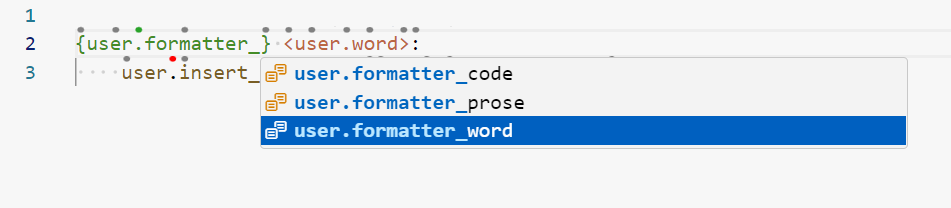
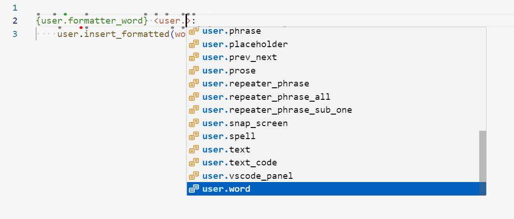
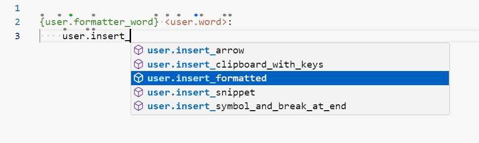
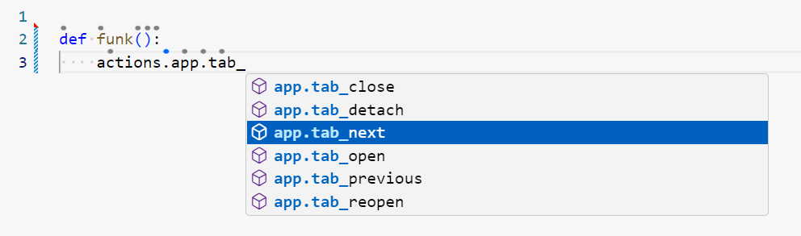

### On hover

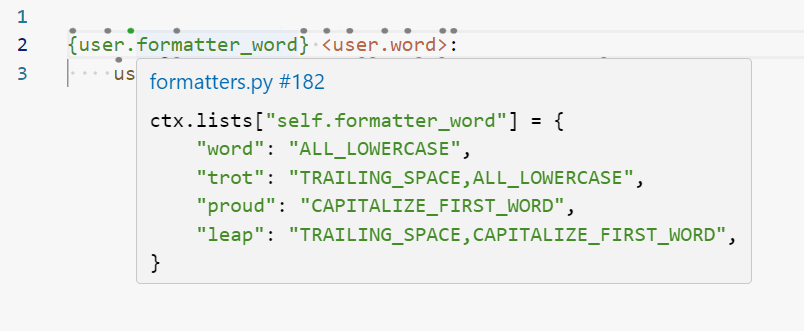
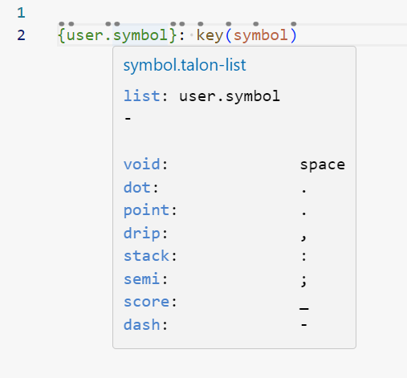
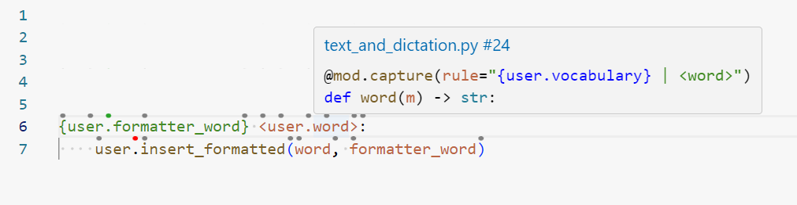
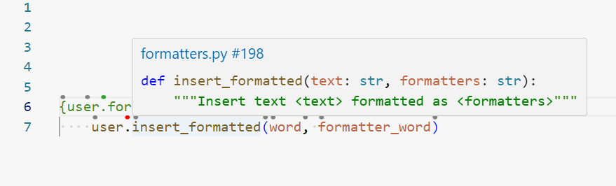
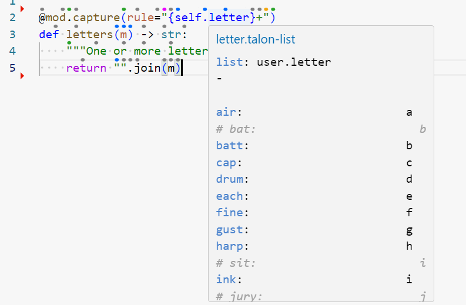
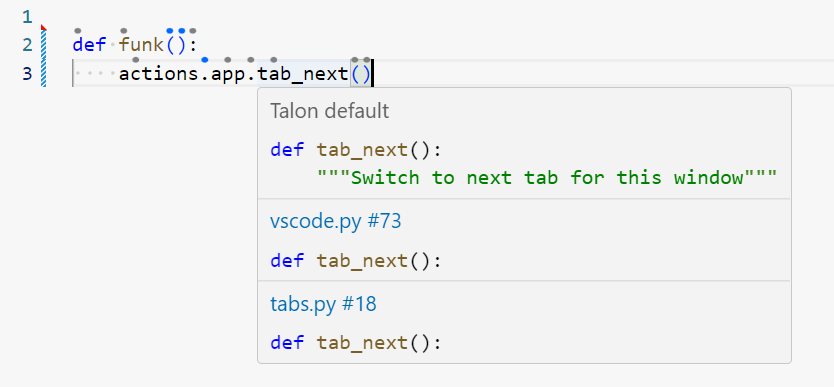

### Go to definition

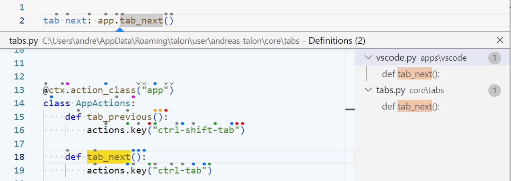
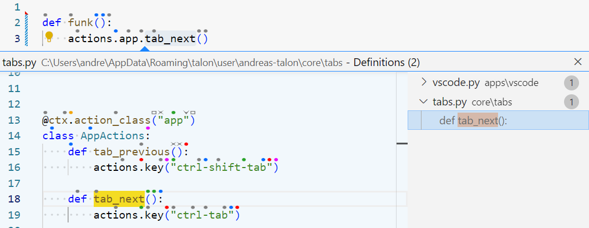

### Quick fix

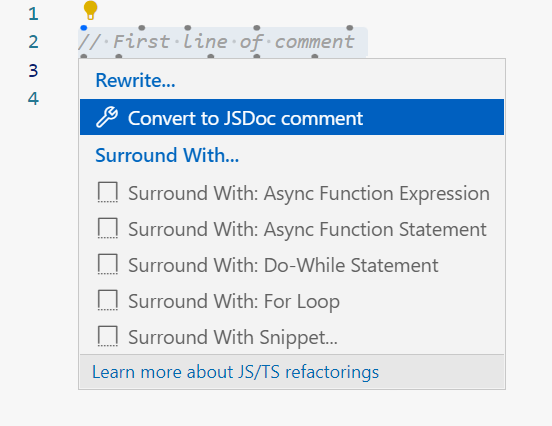

### Tab view

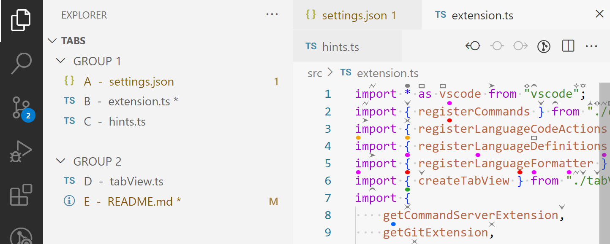

### Format selected files context menu

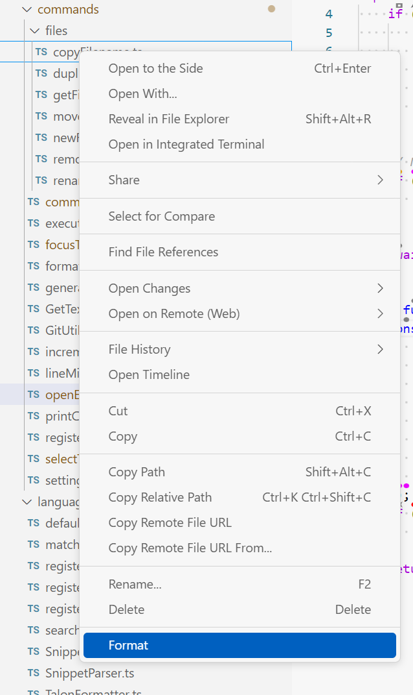

## Demo

[YouTube - On hover and go to definition](https://youtu.be/UdMLNVLkBkg)

[YouTube - Tab view](https://youtu.be/35yRJwSjTCk)

[YouTube - Format selected files](https://youtu.be/UiWT6GI86Nw)

## Build

```bash
$ npm install -g vsce
$ vsce package
```

## Dependencies

- [Command server](https://marketplace.visualstudio.com/items?itemName=pokey.command-server)
- [Parse tree](https://marketplace.visualstudio.com/items?itemName=pokey.parse-tree)

## Resources

- [Talon Voice](https://talonvoice.com)
